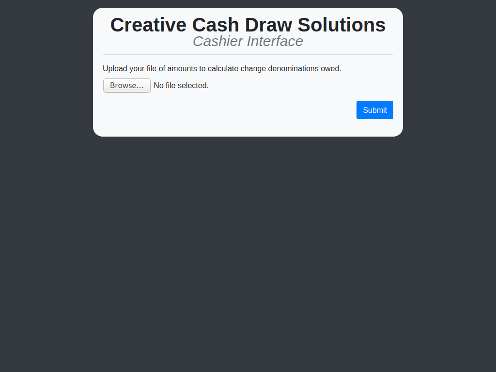
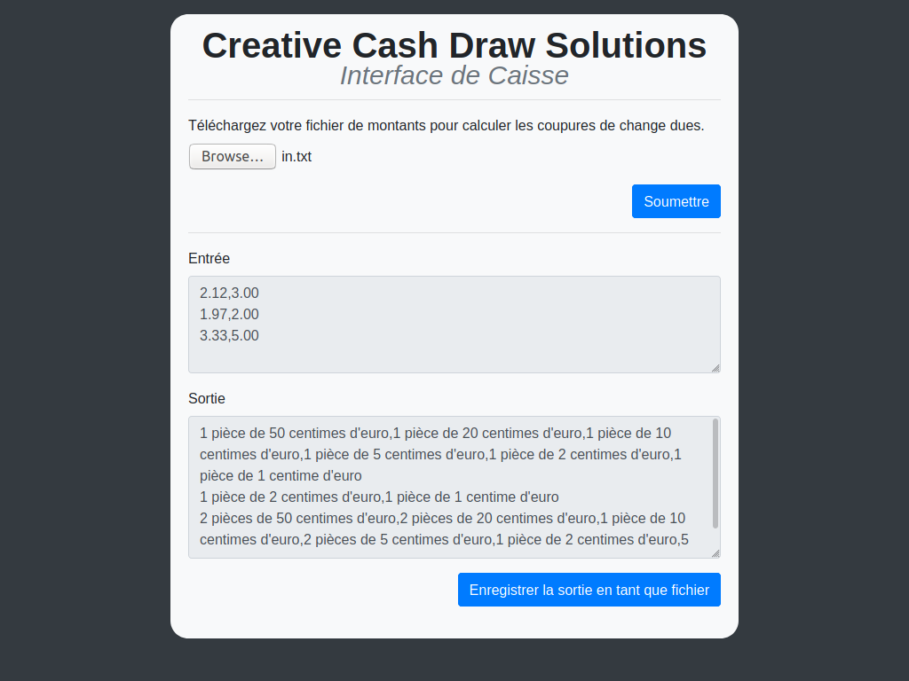

# Creative Cash Draw Solutions

## About
This app was created in PHP, Typescript, Sass, and HTML5 running on a LAMP (Ubuntu Linux 18.04, Apache 2, MariaDB, PHP) stack.

I chose to maintain compatiblity with older versions of PHP back to 5.6; none of the syntax or functions used are deprecated or obsolete in newer PHP versions to my knowledge. However, dropping support for PHP 5 would allow some code refactoring, for example using Slim v4 instead of v3.

Expanding on the 'Things to Consider' section of the prompt, I have made a French version of the app  (in French and using Euros for denominations) which can be viewed by changing the LANGUAGE constant in config.php to 'fr-FR'. Note that the File input will still be shown in English unless the OS system language is also set to French as that text is controlled by the browser exclusively.

## Testing
The app was tested in the following browsers:
* Firefox (latest)
* Chrome (latest)

It was not tested, but should also work, in these browsers:
* Safari (latest)
* Edge (latest)
* Internet Explorer 11

## Assumptions
* The prompt asks for the special case to trigger when the owed amount is "divisible by 3"; I am assuming this means 3 cents and not 3 dollars, based on the example given.
* For returned text values of money, I am omitting rare coin/note values, for example the half-dollar and $2 bill. Values should be the standard values found in an average cash drawer.
* For localization, I am assuming one currency type per language. Situations could theoretically exist that would require multiple currencies to be handled by one cashier, or stores that use a currency not associated with the locale's standard language; however, this would add quite a bit of complexity and seems both unlikely and outside the scope of this assignment.

## Install Procedure
Command examples below were made for Ubuntu 18.04 and may differ depending on OS and version.

### Set up the \*AMP stack
Unzip all files in the project to `/var/www/cashregister/`.
```
sudo mkdir /var/www/cashregister
cp cashregister.zip /var/www/cashregister.zip
cd /var/www/cashregister
unzip cashregister.zip
```

Install [Apache](https://www.apache.org/) and set up a VirtualHost using cashregister.conf
```
sudo apt update
sudo apt install apache2
sudo cp cashregister.conf /etc/apache2/sites-available/cashregister.conf
```

Add the following lines to your `/etc/apache2/apache.conf` file:
```
<Directory /var/www/cashregister/>
    AllowOverride All
    Order allow,deny
    Allow from all
</Directory>
```

Install and set up [MariaDB](https://mariadb.org/) (or MySQL). The version I used was MariaDB 10.1.47.
```
sudo apt install mariadb-server
sudo mysql_secure_installation
```

Install and set up [PHP](https://www.php.net/) and [phpMyAdmin](https://www.phpmyadmin.net/). The version I used was PHP 7.2.24.
```
sudo apt install php libapache2-mod-php php-mysql phpmyadmin
```
### Set up the project
In phpMyAdmin (http://cashregister.localhost/phpmyadmin), log in as root or other admin account and import `cash_register.sql`. This will set up the `cash_register` database and `test` user.

Install npm (via [Nodejs](https://nodejs.org/)) and [Composer](https://getcomposer.org/).
```
sudo apt install nodejs composer
```

Install required composer packages (Slim and phpUnit).
```
composer install
```

Install required npm packages (jQuery, bootstrap, sass, typescript, and apidoc).
```
npm install
```

Compile typescript and sass files to js and css.
```
npm run build
```

Build API documentation (Available at http://cashregister.localhost/apidoc/).
```
npm run build_doc
```

Run API unit tests.
```
npm test
```

## Screenshots
Initial app state.


After selecting and submitting `in.txt`.


French version (can be set by changing LANGUAGE constant to 'fr-FR' in config.php).

